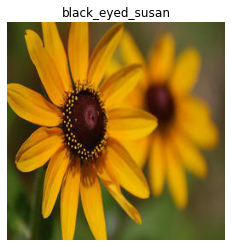
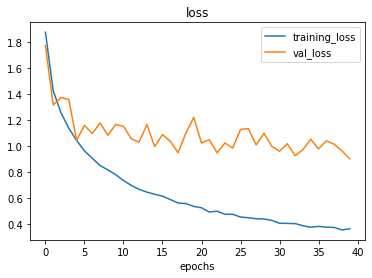
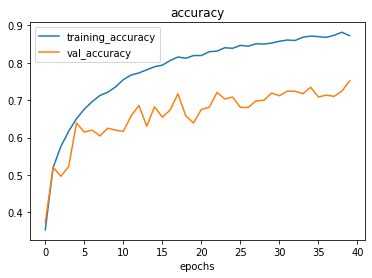
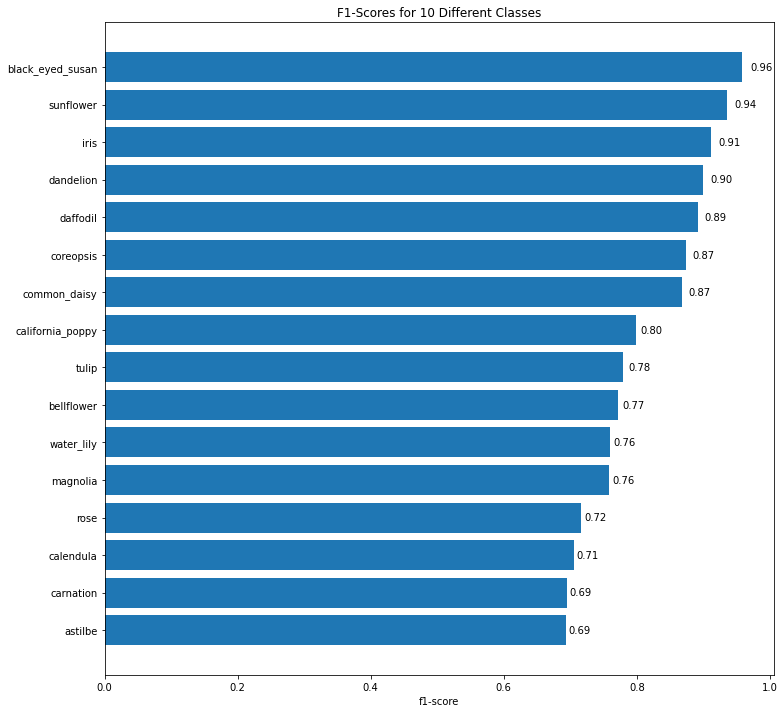
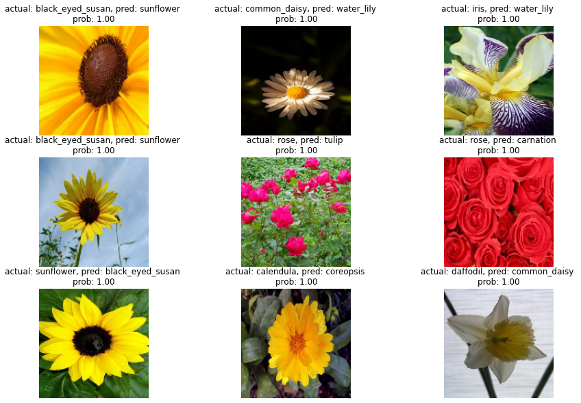
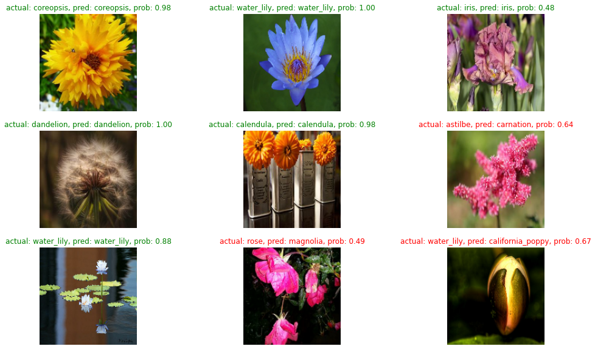

# Computer Vision with tensorflow (CNN): 🌸\| Flowers {#computer-vision-with-tensorflow-cnn--flowers}

I\'m going to work with 16 classes of flowers (Multi-class
classification)

The data Iam going to work with is the **Flowers** dataset from kaggle:
<https://www.kaggle.com/datasets/l3llff/flowers>
:::

::: {.cell .code execution_count="1" id="GZN5himreemI"}
``` {.python}
# Import required libraries
import tensorflow as tf
import numpy as np
import pandas as pd
import matplotlib.pyplot as plt
```
:::

::: {.cell .markdown id="jIiW6VtDcSul"}
## Import the data and become one with it. {#import-the-data-and-become-one-with-it}

Download the data from google drive.

If you want to see how to get data from Kaggle and split it flow this
linke:
<https://github.com/zain2525/TensorFlow-Computer-Vision-project/blob/main/Prepare_flower_data.ipynb>
:::

::: {.cell .code execution_count="2" colab="{\"base_uri\":\"https://localhost:8080/\"}" id="k2PnORWDbJOZ" outputId="1453a051-9c9d-4211-ad74-9b2c21af5760"}
``` {.python}
!gdown --id 1SLDNPYcuDbt300xekB9oyRpf-pEsgNph
```

::: {.output .stream .stdout}
    /usr/local/lib/python3.7/dist-packages/gdown/cli.py:131: FutureWarning: Option `--id` was deprecated in version 4.3.1 and will be removed in 5.0. You don't need to pass it anymore to use a file ID.
      category=FutureWarning,
    Downloading...
    From: https://drive.google.com/uc?id=1SLDNPYcuDbt300xekB9oyRpf-pEsgNph
    To: /content/Flowers.zip
    100% 239M/239M [00:28<00:00, 8.46MB/s]
:::
:::

::: {.cell .markdown id="PYgHm9keeFJO"}
Unzip the data
:::

::: {.cell .code execution_count="3" id="p_zdaUked70R"}
``` {.python}
import zipfile

# Unzip our data
zip_ref = zipfile.ZipFile("Flowers.zip", "r")
zip_ref.extractall()
zip_ref.close()
```
:::

::: {.cell .markdown id="ut6MhNfXfHHM"}
How many images in each folder?
:::

::: {.cell .code execution_count="4" colab="{\"base_uri\":\"https://localhost:8080/\"}" id="waWX1AX4e2VG" outputId="d0027976-f3db-4d65-d65c-0b11d2f2cfdb"}
``` {.python}
import os

# Walk through 10 classes of food image data
for dirpath, dirnames, filenames in os.walk("/content/content/Flowers"):
  print(f"There are {len(dirnames)} directories and {len(filenames)} images in '{dirpath}'.")
```

::: {.output .stream .stdout}
    There are 3 directories and 0 images in '/content/content/Flowers'.
    There are 16 directories and 0 images in '/content/content/Flowers/train'.
    There are 0 directories and 800 images in '/content/content/Flowers/train/black_eyed_susan'.
    There are 0 directories and 698 images in '/content/content/Flowers/train/bellflower'.
    There are 0 directories and 817 images in '/content/content/Flowers/train/california_poppy'.
    There are 0 directories and 782 images in '/content/content/Flowers/train/calendula'.
    There are 0 directories and 838 images in '/content/content/Flowers/train/magnolia'.
    There are 0 directories and 843 images in '/content/content/Flowers/train/iris'.
    There are 0 directories and 841 images in '/content/content/Flowers/train/dandelion'.
    There are 0 directories and 785 images in '/content/content/Flowers/train/water_lily'.
    There are 0 directories and 589 images in '/content/content/Flowers/train/astilbe'.
    There are 0 directories and 821 images in '/content/content/Flowers/train/sunflower'.
    There are 0 directories and 799 images in '/content/content/Flowers/train/rose'.
    There are 0 directories and 837 images in '/content/content/Flowers/train/coreopsis'.
    There are 0 directories and 838 images in '/content/content/Flowers/train/tulip'.
    There are 0 directories and 738 images in '/content/content/Flowers/train/carnation'.
    There are 0 directories and 784 images in '/content/content/Flowers/train/common_daisy'.
    There are 0 directories and 776 images in '/content/content/Flowers/train/daffodil'.
    There are 16 directories and 0 images in '/content/content/Flowers/test'.
    There are 0 directories and 50 images in '/content/content/Flowers/test/black_eyed_susan'.
    There are 0 directories and 45 images in '/content/content/Flowers/test/bellflower'.
    There are 0 directories and 52 images in '/content/content/Flowers/test/california_poppy'.
    There are 0 directories and 50 images in '/content/content/Flowers/test/calendula'.
    There are 0 directories and 53 images in '/content/content/Flowers/test/magnolia'.
    There are 0 directories and 53 images in '/content/content/Flowers/test/iris'.
    There are 0 directories and 54 images in '/content/content/Flowers/test/dandelion'.
    There are 0 directories and 50 images in '/content/content/Flowers/test/water_lily'.
    There are 0 directories and 38 images in '/content/content/Flowers/test/astilbe'.
    There are 0 directories and 52 images in '/content/content/Flowers/test/sunflower'.
    There are 0 directories and 51 images in '/content/content/Flowers/test/rose'.
    There are 0 directories and 53 images in '/content/content/Flowers/test/coreopsis'.
    There are 0 directories and 53 images in '/content/content/Flowers/test/tulip'.
    There are 0 directories and 47 images in '/content/content/Flowers/test/carnation'.
    There are 0 directories and 49 images in '/content/content/Flowers/test/common_daisy'.
    There are 0 directories and 49 images in '/content/content/Flowers/test/daffodil'.
    There are 16 directories and 0 images in '/content/content/Flowers/val'.
    There are 0 directories and 150 images in '/content/content/Flowers/val/black_eyed_susan'.
    There are 0 directories and 130 images in '/content/content/Flowers/val/bellflower'.
    There are 0 directories and 153 images in '/content/content/Flowers/val/california_poppy'.
    There are 0 directories and 146 images in '/content/content/Flowers/val/calendula'.
    There are 0 directories and 157 images in '/content/content/Flowers/val/magnolia'.
    There are 0 directories and 158 images in '/content/content/Flowers/val/iris'.
    There are 0 directories and 157 images in '/content/content/Flowers/val/dandelion'.
    There are 0 directories and 147 images in '/content/content/Flowers/val/water_lily'.
    There are 0 directories and 110 images in '/content/content/Flowers/val/astilbe'.
    There are 0 directories and 154 images in '/content/content/Flowers/val/sunflower'.
    There are 0 directories and 149 images in '/content/content/Flowers/val/rose'.
    There are 0 directories and 157 images in '/content/content/Flowers/val/coreopsis'.
    There are 0 directories and 157 images in '/content/content/Flowers/val/tulip'.
    There are 0 directories and 138 images in '/content/content/Flowers/val/carnation'.
    There are 0 directories and 147 images in '/content/content/Flowers/val/common_daisy'.
    There are 0 directories and 145 images in '/content/content/Flowers/val/daffodil'.
:::
:::

::: {.cell .code execution_count="57" id="4bIBvBdkfQ26"}
``` {.python}
# Getting our train, validation and test directory
train_dir = "/content/content/Flowers/train/"
val_dir= "/content/content/Flowers/val/"
test_dir = "/content/content/Flowers/test/" 
```
:::

::: {.cell .code execution_count="6" colab="{\"base_uri\":\"https://localhost:8080/\"}" id="1tjYObA6gMUJ" outputId="72f38a99-edac-4804-88d2-7f90feb0e094"}
``` {.python}
# Let's get the class names
import pathlib
import numpy as np
data_dir = pathlib.Path(train_dir)
class_names = np.array(sorted([item.name for item in data_dir.glob('*')]))
print(class_names)
```

::: {.output .stream .stdout}
    ['astilbe' 'bellflower' 'black_eyed_susan' 'calendula' 'california_poppy'
     'carnation' 'common_daisy' 'coreopsis' 'daffodil' 'dandelion' 'iris'
     'magnolia' 'rose' 'sunflower' 'tulip' 'water_lily']
:::
:::

::: {.cell .code execution_count="7" colab="{\"base_uri\":\"https://localhost:8080/\"}" id="o2mJ7b_ygRXv" outputId="5df0c612-bf43-4793-f6ca-c2d6afc4ad15"}
``` {.python}
# Let's see how many class we have
len(class_names)
```

::: {.output .execute_result execution_count="7"}
    16
:::
:::

::: {.cell .markdown id="jb_KQ7Q-gVQL"}
Let\'s visulize a random image?
:::

::: {.cell .code execution_count="8" id="eQwRD0wTgcru"}
``` {.python}
import matplotlib.image as mpimg
import random
```
:::

::: {.cell .code execution_count="9" id="L9pa5XZigTFn"}
``` {.python}
# Let's define a function to view random image
def view_random_image(target_dir, target_class):
  # Setup the target directory(we'll view images from here)
  target_folder = target_dir + target_class

  # Get a random image path
  random_image = random.sample(os.listdir(target_folder), 1)

  # Read in the image and plot it using matplotlob
  img = mpimg.imread(target_folder + "/" + random_image[0])
  plt.imshow(img)
  plt.title(target_class)
  plt.axis("off");

  print(f"Image shape: {img.shape}")

  return img
```
:::

::: {.cell .code execution_count="10" colab="{\"height\":281,\"base_uri\":\"https://localhost:8080/\"}" id="OLEJwgIcggrJ" outputId="7712228d-3999-4807-d93f-6b73325d745e"}
``` {.python}
# Visulize
img = view_random_image(target_dir=train_dir,
                        target_class=random.choice(class_names))
```

::: {.output .stream .stdout}
    Image shape: (256, 256, 3)
:::

::: {.output .display_data}

:::
:::

::: {.cell .markdown id="8zy-pdIMg9dw"}
## Preprocess the data (prepare it for the model)
:::

::: {.cell .code execution_count="11" colab="{\"base_uri\":\"https://localhost:8080/\"}" id="gWztr0zugipo" outputId="4ff32450-38e9-44ce-fef4-d5100f97ebcc"}
``` {.python}
# Setup data inputs
IMG_SIZE = (150, 150)

# Load data in from directores and turn it into batches
train_data = tf.keras.preprocessing.image_dataset_from_directory(train_dir,
                                                                  label_mode="categorical",
                                                                  image_size=IMG_SIZE)

# load data in directores and turn it into batches
val_data = tf.keras.preprocessing.image_dataset_from_directory(val_dir,
                                                               label_mode="categorical",
                                                                image_size=IMG_SIZE,
                                                                shuffle=False)

# load data in directores and turn it into batches 
test_data = tf.keras.preprocessing.image_dataset_from_directory(test_dir,
                                                                label_mode="categorical",
                                                                image_size=IMG_SIZE,
                                                                shuffle=False)
```

::: {.output .stream .stdout}
    Found 12586 files belonging to 16 classes.
    Found 2355 files belonging to 16 classes.
    Found 799 files belonging to 16 classes.
:::
:::

::: {.cell .markdown id="KOKHSteSikhd"}
As we can see there are 12586 image in the train data divided on 16
Classes. And there are 2355 image in validatuon data divided on 16
classes. And there 799 image in test data divided on 16 classes.
:::

::: {.cell .markdown id="irn7Av2D6m9U"}
And that\'s it! Our data augmentation Sequential model is ready to go.
As you\'ll see shortly, we\'ll be able to slot this `model`.
:::

::: {.cell .markdown id="ytxEBCu36raq"}
But before we do that, let\'s test it out by passing random images
through it.
:::

::: {.cell .markdown id="Q7Yv-Bbmmqqw"}
## Create the model
:::

::: {.cell .code execution_count="12" id="WBQMK13wlBDo"}
``` {.python}
# Make the creating of our model a littel easier
from tensorflow import keras
from tensorflow.keras import layers
from tensorflow.keras.models import Sequential
from tensorflow.keras.layers import Conv2D, MaxPool2D, Flatten, Dense, Dropout
from tensorflow.keras.optimizers import Adam
```
:::

::: {.cell .code execution_count="24" colab="{\"base_uri\":\"https://localhost:8080/\"}" id="DFiqsOgQMUlc" outputId="2402a1f1-8d52-421d-83db-5188759939ce"}
``` {.python}
# Create inputs for the model
inputs = layers.Input(shape=(150, 150, 3))
# Add the preprocessing/augmentation layers.
x = layers.RandomFlip('horizontal')(inputs)
x = tf.keras.layers.RandomRotation(0.2)(x)
x = tf.keras.layers.RandomZoom(0.2)(x)
x = tf.keras.layers.Rescaling(1./255)(x)
# Add the model layers.
x = Conv2D(32, 3, activation="relu")(x)
x = MaxPool2D()(x)
x = Conv2D(64, 3, activation="relu")(x)
x = MaxPool2D()(x)
x = Conv2D(128, 3, activation="relu")(x)
x = MaxPool2D()(x)
x = Conv2D(128, 3, activation="relu")(x)
x = MaxPool2D()(x)
x = Dropout(0.2)(x)
x = Flatten()(x)
x = tf.keras.layers.Dense(128, activation='relu')(x)
outputs = Dense(16, activation='softmax')(x)
# model
model = keras.Model(inputs, outputs)

# model summary
model.summary() 
```

::: {.output .stream .stdout}
    Model: "model_2"
    _________________________________________________________________
     Layer (type)                Output Shape              Param #   
    =================================================================
     input_3 (InputLayer)        [(None, 150, 150, 3)]     0         
                                                                     
     random_flip_2 (RandomFlip)  (None, 150, 150, 3)       0         
                                                                     
     random_rotation_2 (RandomRo  (None, 150, 150, 3)      0         
     tation)                                                         
                                                                     
     random_zoom_2 (RandomZoom)  (None, 150, 150, 3)       0         
                                                                     
     rescaling_2 (Rescaling)     (None, 150, 150, 3)       0         
                                                                     
     conv2d_8 (Conv2D)           (None, 148, 148, 32)      896       
                                                                     
     max_pooling2d_8 (MaxPooling  (None, 74, 74, 32)       0         
     2D)                                                             
                                                                     
     conv2d_9 (Conv2D)           (None, 72, 72, 64)        18496     
                                                                     
     max_pooling2d_9 (MaxPooling  (None, 36, 36, 64)       0         
     2D)                                                             
                                                                     
     conv2d_10 (Conv2D)          (None, 34, 34, 128)       73856     
                                                                     
     max_pooling2d_10 (MaxPoolin  (None, 17, 17, 128)      0         
     g2D)                                                            
                                                                     
     conv2d_11 (Conv2D)          (None, 15, 15, 128)       147584    
                                                                     
     max_pooling2d_11 (MaxPoolin  (None, 7, 7, 128)        0         
     g2D)                                                            
                                                                     
     dropout_2 (Dropout)         (None, 7, 7, 128)         0         
                                                                     
     flatten_2 (Flatten)         (None, 6272)              0         
                                                                     
     dense_2 (Dense)             (None, 128)               802944    
                                                                     
     dense_3 (Dense)             (None, 16)                2064      
                                                                     
    =================================================================
    Total params: 1,045,840
    Trainable params: 1,045,840
    Non-trainable params: 0
    _________________________________________________________________
:::
:::

::: {.cell .code execution_count="25" id="Fy20CNKZnd9g"}
``` {.python}
# Compile the model
model.compile(loss="categorical_crossentropy",
              optimizer=Adam(),
              metrics=["accuracy"])
```
:::

::: {.cell .code execution_count="26" colab="{\"base_uri\":\"https://localhost:8080/\"}" id="38sLLQ-EoM2H" outputId="d766e8f7-4d60-4fc5-cdde-29fa6d397718"}
``` {.python}
# Fit the model
history = model.fit(train_data,
                        epochs=40,
                        steps_per_epoch=len(train_data),
                        validation_data=val_data,
                        validation_steps=int(.25 * len(val_data)))
```

::: {.output .stream .stdout}
    Epoch 1/40
    394/394 [==============================] - 26s 63ms/step - loss: 1.8724 - accuracy: 0.3531 - val_loss: 1.7699 - val_accuracy: 0.3733
    Epoch 2/40
    394/394 [==============================] - 27s 68ms/step - loss: 1.4228 - accuracy: 0.5199 - val_loss: 1.3141 - val_accuracy: 0.5208
    Epoch 3/40
    394/394 [==============================] - 25s 62ms/step - loss: 1.2535 - accuracy: 0.5762 - val_loss: 1.3717 - val_accuracy: 0.4965
    Epoch 4/40
    394/394 [==============================] - 25s 64ms/step - loss: 1.1350 - accuracy: 0.6171 - val_loss: 1.3552 - val_accuracy: 0.5226
    Epoch 5/40
    394/394 [==============================] - 25s 62ms/step - loss: 1.0422 - accuracy: 0.6502 - val_loss: 1.0432 - val_accuracy: 0.6389
    Epoch 6/40
    394/394 [==============================] - 25s 63ms/step - loss: 0.9616 - accuracy: 0.6760 - val_loss: 1.1576 - val_accuracy: 0.6146
    Epoch 7/40
    394/394 [==============================] - 26s 64ms/step - loss: 0.9053 - accuracy: 0.6959 - val_loss: 1.0945 - val_accuracy: 0.6198
    Epoch 8/40
    394/394 [==============================] - 25s 64ms/step - loss: 0.8497 - accuracy: 0.7125 - val_loss: 1.1766 - val_accuracy: 0.6042
    Epoch 9/40
    394/394 [==============================] - 25s 63ms/step - loss: 0.8155 - accuracy: 0.7211 - val_loss: 1.0812 - val_accuracy: 0.6250
    Epoch 10/40
    394/394 [==============================] - 25s 64ms/step - loss: 0.7798 - accuracy: 0.7353 - val_loss: 1.1648 - val_accuracy: 0.6198
    Epoch 11/40
    394/394 [==============================] - 25s 63ms/step - loss: 0.7342 - accuracy: 0.7549 - val_loss: 1.1502 - val_accuracy: 0.6163
    Epoch 12/40
    394/394 [==============================] - 24s 61ms/step - loss: 0.6970 - accuracy: 0.7670 - val_loss: 1.0551 - val_accuracy: 0.6580
    Epoch 13/40
    394/394 [==============================] - 25s 62ms/step - loss: 0.6668 - accuracy: 0.7728 - val_loss: 1.0290 - val_accuracy: 0.6858
    Epoch 14/40
    394/394 [==============================] - 26s 66ms/step - loss: 0.6450 - accuracy: 0.7810 - val_loss: 1.1643 - val_accuracy: 0.6302
    Epoch 15/40
    394/394 [==============================] - 25s 62ms/step - loss: 0.6288 - accuracy: 0.7894 - val_loss: 0.9951 - val_accuracy: 0.6823
    Epoch 16/40
    394/394 [==============================] - 25s 63ms/step - loss: 0.6143 - accuracy: 0.7934 - val_loss: 1.0864 - val_accuracy: 0.6545
    Epoch 17/40
    394/394 [==============================] - 25s 63ms/step - loss: 0.5885 - accuracy: 0.8058 - val_loss: 1.0357 - val_accuracy: 0.6736
    Epoch 18/40
    394/394 [==============================] - 25s 64ms/step - loss: 0.5618 - accuracy: 0.8154 - val_loss: 0.9473 - val_accuracy: 0.7170
    Epoch 19/40
    394/394 [==============================] - 25s 62ms/step - loss: 0.5573 - accuracy: 0.8119 - val_loss: 1.0985 - val_accuracy: 0.6580
    Epoch 20/40
    394/394 [==============================] - 24s 61ms/step - loss: 0.5354 - accuracy: 0.8192 - val_loss: 1.2188 - val_accuracy: 0.6389
    Epoch 21/40
    394/394 [==============================] - 25s 63ms/step - loss: 0.5251 - accuracy: 0.8192 - val_loss: 1.0221 - val_accuracy: 0.6753
    Epoch 22/40
    394/394 [==============================] - 25s 62ms/step - loss: 0.4926 - accuracy: 0.8294 - val_loss: 1.0481 - val_accuracy: 0.6806
    Epoch 23/40
    394/394 [==============================] - 25s 62ms/step - loss: 0.4988 - accuracy: 0.8309 - val_loss: 0.9466 - val_accuracy: 0.7205
    Epoch 24/40
    394/394 [==============================] - 25s 63ms/step - loss: 0.4750 - accuracy: 0.8401 - val_loss: 1.0225 - val_accuracy: 0.7031
    Epoch 25/40
    394/394 [==============================] - 25s 62ms/step - loss: 0.4749 - accuracy: 0.8386 - val_loss: 0.9836 - val_accuracy: 0.7083
    Epoch 26/40
    394/394 [==============================] - 26s 66ms/step - loss: 0.4538 - accuracy: 0.8463 - val_loss: 1.1259 - val_accuracy: 0.6806
    Epoch 27/40
    394/394 [==============================] - 24s 62ms/step - loss: 0.4486 - accuracy: 0.8441 - val_loss: 1.1334 - val_accuracy: 0.6806
    Epoch 28/40
    394/394 [==============================] - 24s 62ms/step - loss: 0.4409 - accuracy: 0.8506 - val_loss: 1.0068 - val_accuracy: 0.6979
    Epoch 29/40
    394/394 [==============================] - 25s 62ms/step - loss: 0.4388 - accuracy: 0.8498 - val_loss: 1.0969 - val_accuracy: 0.6997
    Epoch 30/40
    394/394 [==============================] - 25s 63ms/step - loss: 0.4283 - accuracy: 0.8525 - val_loss: 0.9970 - val_accuracy: 0.7188
    Epoch 31/40
    394/394 [==============================] - 26s 64ms/step - loss: 0.4062 - accuracy: 0.8574 - val_loss: 0.9593 - val_accuracy: 0.7118
    Epoch 32/40
    394/394 [==============================] - 25s 63ms/step - loss: 0.4051 - accuracy: 0.8606 - val_loss: 1.0172 - val_accuracy: 0.7240
    Epoch 33/40
    394/394 [==============================] - 26s 65ms/step - loss: 0.4035 - accuracy: 0.8594 - val_loss: 0.9247 - val_accuracy: 0.7240
    Epoch 34/40
    394/394 [==============================] - 25s 64ms/step - loss: 0.3867 - accuracy: 0.8681 - val_loss: 0.9719 - val_accuracy: 0.7170
    Epoch 35/40
    394/394 [==============================] - 25s 62ms/step - loss: 0.3759 - accuracy: 0.8711 - val_loss: 1.0508 - val_accuracy: 0.7344
    Epoch 36/40
    394/394 [==============================] - 24s 62ms/step - loss: 0.3822 - accuracy: 0.8698 - val_loss: 0.9772 - val_accuracy: 0.7083
    Epoch 37/40
    394/394 [==============================] - 24s 62ms/step - loss: 0.3765 - accuracy: 0.8678 - val_loss: 1.0382 - val_accuracy: 0.7135
    Epoch 38/40
    394/394 [==============================] - 26s 66ms/step - loss: 0.3741 - accuracy: 0.8734 - val_loss: 1.0132 - val_accuracy: 0.7101
    Epoch 39/40
    394/394 [==============================] - 25s 62ms/step - loss: 0.3551 - accuracy: 0.8815 - val_loss: 0.9613 - val_accuracy: 0.7240
    Epoch 40/40
    394/394 [==============================] - 25s 62ms/step - loss: 0.3638 - accuracy: 0.8723 - val_loss: 0.9006 - val_accuracy: 0.7517
:::
:::

::: {.cell .markdown id="g_VLgRXYDqdS"}
## Evaulate the model
:::

::: {.cell .code execution_count="27" colab="{\"base_uri\":\"https://localhost:8080/\"}" id="cw2L0qkJodt_" outputId="7eaac18e-15fb-4efb-9f17-d7c3d2019767"}
``` {.python}
# Evalaute on all validation data
model_results = model.evaluate(val_data)
model_results
```

::: {.output .stream .stdout}
    74/74 [==============================] - 2s 29ms/step - loss: 0.6575 - accuracy: 0.8170
:::

::: {.output .execute_result execution_count="27"}
    [0.657538115978241, 0.8169851303100586]
:::
:::

::: {.cell .code execution_count="28" id="13MjTL-UD2AA"}
``` {.python}
# Plot the validation and training curves
def plot_loss_curves(history):
  """
  Returnes separate loss curves for training and validation metrics.
  """
  loss = history.history["loss"]
  val_loss = history.history["val_loss"]

  accuracy = history.history["accuracy"]
  val_accuracy = history.history["val_accuracy"]

  epochs = range(len(history.history["loss"]))

  # Plot loss
  plt.plot(epochs, loss, label="training_loss")
  plt.plot(epochs, val_loss, label="val_loss")
  plt.title("loss")
  plt.xlabel("epochs")
  plt.legend()

  # Plot accuracy
  plt.figure()
  plt.plot(epochs, accuracy, label="training_accuracy")
  plt.plot(epochs, val_accuracy, label="val_accuracy")
  plt.title("accuracy")
  plt.xlabel("epochs")
  plt.legend();
```
:::

::: {.cell .code execution_count="29" colab="{\"height\":573,\"base_uri\":\"https://localhost:8080/\"}" id="A6zluustD9fm" outputId="4f43297c-b4f5-4895-bdbc-dcca71c88e28"}
``` {.python}
# Cheak out the model's loss curves on the 10 classes
plot_loss_curves(history)
```

::: {.output .display_data}

:::

::: {.output .display_data}

:::
:::

::: {.cell .markdown id="MytvoEQdEJWO"}
## Making predictions with our trained model
:::

::: {.cell .markdown id="cfgvYnh5FYX2"}
To evaluate our trained model, we need to make some predictions with it
and then compare those predictions to the test dataset.

Because the model has never seen the test dataset, this should give us
an indication of how the model will perform in the real world on data
similar to what it has been trained on.
:::

::: {.cell .code execution_count="30" colab="{\"base_uri\":\"https://localhost:8080/\"}" id="PxQtjUt2D_NO" outputId="b10440e8-e97f-4696-89e7-795882cb0657"}
``` {.python}
# Make predictions with model
pred_probs = model.predict(val_data, verbose=1) # set verbosity to see how long it will take 
```

::: {.output .stream .stdout}
    74/74 [==============================] - 2s 30ms/step
:::
:::

::: {.cell .code execution_count="31" colab="{\"base_uri\":\"https://localhost:8080/\"}" id="WgUpQ54qFbVW" outputId="eba33a24-c8b0-4e9c-acaa-4e83fbfc2aa2"}
``` {.python}
# How many predictions are there?
len(pred_probs)
```

::: {.output .execute_result execution_count="31"}
    2355
:::
:::

::: {.cell .code execution_count="32" colab="{\"base_uri\":\"https://localhost:8080/\"}" id="1IB1gjF5Ffgm" outputId="6de49cd8-7ccf-404e-fd14-3b76f6270bdd"}
``` {.python}
# Get the class predicitons of each label
pred_classes = pred_probs.argmax(axis=1)

# How do they look?
pred_classes[:10]
```

::: {.output .execute_result execution_count="32"}
    array([ 0,  0,  0,  0,  0, 14,  0,  0,  0,  5])
:::
:::

::: {.cell .markdown id="UC4s5_E3FvLt"}
Beautiful! We\'ve now got the predicted class index for each of the
samples in our validation dataset.

We\'ll be able to compare these to the validation dataset labels to
further evaluate our model.
:::

::: {.cell .markdown id="bWmuh6xYIIsl"}
**Note:** This unravelling is why we `shuffle=False` when creating the
validation data object. Otherwise, whenever we loaded the validation
dataset (like when making predictions), it would be shuffled every time,
meaning if we tried to compare our predictions to the labels, they would
be in different orders.
:::

::: {.cell .code execution_count="33" colab="{\"base_uri\":\"https://localhost:8080/\"}" id="0jYbI9o6FoXc" outputId="c53a0335-aabe-42c5-98a9-7e2dcd9ef442"}
``` {.python}
y_labels = []
for images, labels in val_data.unbatch(): # unbatch the test data and get images and labels
  y_labels.append(labels.numpy().argmax()) # append the index which has the largest value (labels are one-hot)
y_labels[:10] # check what they look like (unshuffled)
```

::: {.output .execute_result execution_count="33"}
    [0, 0, 0, 0, 0, 0, 0, 0, 0, 0]
:::
:::

::: {.cell .markdown id="gkZG89CvH8dW"}
Nice! Since `val_data` isn\'t shuffled, the `y_labels` array comes back
in the same order as the `pred_classes` array.
:::

::: {.cell .code execution_count="34" colab="{\"base_uri\":\"https://localhost:8080/\"}" id="wYvc3QbLF2FM" outputId="a5b95c90-691a-4e9d-a527-aec736b81605"}
``` {.python}
# How many labels are there? (should be the same as how many prediction probabilities we have)
len(y_labels)
```

::: {.output .execute_result execution_count="34"}
    2355
:::
:::

::: {.cell .markdown id="BfgJxSuqIgsd"}
A very simple evaluation is to use Scikit-Learn\'s `accuracy_score()`
function which compares truth labels to predicted labels and returns an
accuracy score.

If we\'ve created our `y_labels` and `pred_classes` arrays correctly,
this should return the same accuracy value (or at least very close) as
the `evaluate()` method we used earlier.
:::

::: {.cell .code execution_count="35" colab="{\"base_uri\":\"https://localhost:8080/\"}" id="78pc6O5DJgrV" outputId="b0a1e4d8-cab1-4bcc-d2bf-437e48e5c606"}
``` {.python}
# Get accuracy score by comparing predicted classes to ground truth labels
from sklearn.metrics import accuracy_score
sklearn_accuracy = accuracy_score(y_labels, pred_classes)
sklearn_accuracy
```

::: {.output .execute_result execution_count="35"}
    0.8169851380042463
:::
:::

::: {.cell .markdown id="WH3Hq8GJJI_c"}
Okay, now let\'s create a confusion_matrix
:::

::: {.cell .markdown id="FdQ_hRRGZXRJ"}
## Create Confusion Matrix
:::

::: {.cell .markdown id="LBuRcaI1Jadx"}
Right now our predictions and truth labels are in the form of integers,
however, they\'ll be much easier to understand if we get their actual
names. We can do so using the `class_names` attribute on our `val_data`
object.
:::

::: {.cell .code execution_count="36" id="BvfQCzJLZ-Nh"}
``` {.python}
# Get the class names
class_names = val_data.class_names
```
:::

::: {.cell .code execution_count="37" id="FOyBwGxmJj20"}
``` {.python}
# Note: The following confusion matrix code is a remix of Scikit-Learn's 
# plot_confusion_matrix function
import itertools
from sklearn.metrics import confusion_matrix

# Our function needs a different name to sklearn's plot_confusion_matrix
def make_confusion_matrix(y_true, y_pred, classes=None, figsize=(10, 10), text_size=15, norm=False, savefig=False): 
  """Makes a labelled confusion matrix comparing predictions and ground truth labels.

  If classes is passed, confusion matrix will be labelled, if not, integer class values
  will be used.

  Args:
    y_true: Array of truth labels (must be same shape as y_pred).
    y_pred: Array of predicted labels (must be same shape as y_true).
    classes: Array of class labels (e.g. string form). If `None`, integer labels are used.
    figsize: Size of output figure (default=(10, 10)).
    text_size: Size of output figure text (default=15).
    norm: normalize values or not (default=False).
    savefig: save confusion matrix to file (default=False).
  
  Returns:
    A labelled confusion matrix plot comparing y_true and y_pred.

  Example usage:
    make_confusion_matrix(y_true=test_labels, # ground truth test labels
                          y_pred=y_preds, # predicted labels
                          classes=class_names, # array of class label names
                          figsize=(15, 15),
                          text_size=10)
  """  
  # Create the confustion matrix
  cm = confusion_matrix(y_true, y_pred)
  cm_norm = cm.astype("float") / cm.sum(axis=1)[:, np.newaxis] # normalize it
  n_classes = cm.shape[0] # find the number of classes we're dealing with

  # Plot the figure and make it pretty
  fig, ax = plt.subplots(figsize=figsize)
  cax = ax.matshow(cm, cmap=plt.cm.Blues) # colors will represent how 'correct' a class is, darker == better
  fig.colorbar(cax)

  # Are there a list of classes?
  if classes:
    labels = classes
  else:
    labels = np.arange(cm.shape[0])
  
  # Label the axes
  ax.set(title="Confusion Matrix",
         xlabel="Predicted label",
         ylabel="True label",
         xticks=np.arange(n_classes), # create enough axis slots for each class
         yticks=np.arange(n_classes), 
         xticklabels=labels, # axes will labeled with class names (if they exist) or ints
         yticklabels=labels)
  
  # Make x-axis labels appear on bottom
  ax.xaxis.set_label_position("bottom")
  ax.xaxis.tick_bottom()

  ### Added: Rotate xticks for readability & increase font size (required due to such a large confusion matrix)
  plt.xticks(rotation=70, fontsize=text_size)
  plt.yticks(fontsize=text_size)

  # Set the threshold for different colors
  threshold = (cm.max() + cm.min()) / 2.

  # Plot the text on each cell
  for i, j in itertools.product(range(cm.shape[0]), range(cm.shape[1])):
    if norm:
      plt.text(j, i, f"{cm[i, j]} ({cm_norm[i, j]*100:.1f}%)",
              horizontalalignment="center",
              color="white" if cm[i, j] > threshold else "black",
              size=text_size)
    else:
      plt.text(j, i, f"{cm[i, j]}",
              horizontalalignment="center",
              color="white" if cm[i, j] > threshold else "black",
              size=text_size)
```
:::

::: {.cell .code execution_count="38" colab="{\"height\":680,\"base_uri\":\"https://localhost:8080/\"}" id="p41tKhzDZpVZ" outputId="796d902f-3e33-4ed3-bd86-bc69329d3953"}
``` {.python}
# Plot a confusion matrix with all 25250 predictions, ground truth labels and 101 classes
make_confusion_matrix(y_true=y_labels,
                      y_pred=pred_classes,
                      classes=class_names,
                      figsize=(10, 10),
                      text_size=15,
                      norm=False,
                      savefig=True)
```

::: {.output .display_data}

:::
:::

::: {.cell .markdown id="HfINsGdlV6nc"}
Now we can see how it gives us insight into which classes its getting
\"confused\" on.

The good news is, the majority of the predictions are right down the top
left to bottom right diagonal, meaning they\'re correct.

It looks like the model gets most confused on classes which look
visualually similar

Since we\'re working on a classification problem, we can further
evaluate our model\'s predictions using Scikit-Learn\'s
`classification_report()` function.
:::

::: {.cell .code execution_count="39" colab="{\"base_uri\":\"https://localhost:8080/\"}" id="DdfBBbp6ZxjT" outputId="599c7457-c170-47d1-c902-19dd681a8c86"}
``` {.python}
from sklearn.metrics import classification_report
print(classification_report(y_labels, pred_classes))
```

::: {.output .stream .stdout}
                  precision    recall  f1-score   support

               0       0.68      0.71      0.69       110
               1       0.87      0.69      0.77       130
               2       0.99      0.93      0.96       150
               3       0.75      0.66      0.71       146
               4       0.89      0.73      0.80       153
               5       0.67      0.72      0.69       138
               6       0.86      0.88      0.87       147
               7       0.85      0.90      0.87       157
               8       0.90      0.88      0.89       145
               9       0.91      0.89      0.90       157
              10       0.95      0.88      0.91       158
              11       0.70      0.83      0.76       157
              12       0.85      0.62      0.72       149
              13       0.93      0.94      0.94       154
              14       0.69      0.89      0.78       157
              15       0.68      0.86      0.76       147

        accuracy                           0.82      2355
       macro avg       0.82      0.81      0.81      2355
    weighted avg       0.83      0.82      0.82      2355
:::
:::

::: {.cell .markdown id="1_iYkuoPWUCe"}
The `classification_report()` outputs the precision, recall and
f1-score\'s per class.
:::

::: {.cell .markdown id="FzVySE-IWaFQ"}
The above output is helpful but with so many classes, it\'s a bit hard
to understand.

Let\'s see if we make it easier with the help of a visualization.

First, we\'ll get the output of `classification_report()` as a
dictionary by setting `output_dict=True`.
:::

::: {.cell .code execution_count="40" colab="{\"base_uri\":\"https://localhost:8080/\"}" id="MyA-4cxuWPr0" outputId="94740573-c24e-4de4-b39d-e54bc0d9c42a"}
``` {.python}
# Get a dictionary of the classification report
classification_report_dict = classification_report(y_labels, pred_classes, output_dict=True)
classification_report_dict
```

::: {.output .execute_result execution_count="40"}
    {'0': {'precision': 0.6782608695652174,
      'recall': 0.7090909090909091,
      'f1-score': 0.6933333333333334,
      'support': 110},
     '1': {'precision': 0.8737864077669902,
      'recall': 0.6923076923076923,
      'f1-score': 0.7725321888412017,
      'support': 130},
     '2': {'precision': 0.9928571428571429,
      'recall': 0.9266666666666666,
      'f1-score': 0.9586206896551723,
      'support': 150},
     '3': {'precision': 0.751937984496124,
      'recall': 0.6643835616438356,
      'f1-score': 0.7054545454545454,
      'support': 146},
     '4': {'precision': 0.888,
      'recall': 0.7254901960784313,
      'f1-score': 0.7985611510791366,
      'support': 153},
     '5': {'precision': 0.673469387755102,
      'recall': 0.717391304347826,
      'f1-score': 0.6947368421052631,
      'support': 138},
     '6': {'precision': 0.86,
      'recall': 0.8775510204081632,
      'f1-score': 0.8686868686868686,
      'support': 147},
     '7': {'precision': 0.8452380952380952,
      'recall': 0.9044585987261147,
      'f1-score': 0.8738461538461538,
      'support': 157},
     '8': {'precision': 0.9014084507042254,
      'recall': 0.8827586206896552,
      'f1-score': 0.89198606271777,
      'support': 145},
     '9': {'precision': 0.9144736842105263,
      'recall': 0.8853503184713376,
      'f1-score': 0.8996763754045308,
      'support': 157},
     '10': {'precision': 0.9455782312925171,
      'recall': 0.879746835443038,
      'f1-score': 0.9114754098360656,
      'support': 158},
     '11': {'precision': 0.6989247311827957,
      'recall': 0.8280254777070064,
      'f1-score': 0.7580174927113703,
      'support': 157},
     '12': {'precision': 0.8518518518518519,
      'recall': 0.6174496644295302,
      'f1-score': 0.7159533073929961,
      'support': 149},
     '13': {'precision': 0.9294871794871795,
      'recall': 0.9415584415584416,
      'f1-score': 0.9354838709677419,
      'support': 154},
     '14': {'precision': 0.693069306930693,
      'recall': 0.89171974522293,
      'f1-score': 0.7799442896935933,
      'support': 157},
     '15': {'precision': 0.6810810810810811,
      'recall': 0.8571428571428571,
      'f1-score': 0.7590361445783133,
      'support': 147},
     'accuracy': 0.8169851380042463,
     'macro avg': {'precision': 0.8237140252762214,
      'recall': 0.8125682443709021,
      'f1-score': 0.8135840453940035,
      'support': 2355},
     'weighted avg': {'precision': 0.8268554102235857,
      'recall': 0.8169851380042463,
      'f1-score': 0.8173290154076344,
      'support': 2355}}
:::
:::

::: {.cell .markdown id="CBgdApt7WmK-"}
Alright, there\'s still a fair few values here, how about we narrow
down?

Since the `f1-score` combines precision and recall in one metric, let\'s
focus on that.

To extract it, we\'ll create an empty dictionary called
`class_f1_scores` and then loop through each item in
`classification_report_dict`, appending the class name and f1-score as
the key, value pairs in `class_f1_scores`.
:::

::: {.cell .code execution_count="41" colab="{\"base_uri\":\"https://localhost:8080/\"}" id="LEaaw8RRWhK6" outputId="d386f948-6efe-4ac6-bb43-5d4bca75b055"}
``` {.python}
# Create empty dictionary
class_f1_scores = {}
# Loop through classification report items
for k, v in classification_report_dict.items():
  if k == "accuracy": # stop once we get to accuracy key
    break
  else:
    # Append class names and f1-scores to new dictionary
    class_f1_scores[class_names[int(k)]] = v["f1-score"]
class_f1_scores
```

::: {.output .execute_result execution_count="41"}
    {'astilbe': 0.6933333333333334,
     'bellflower': 0.7725321888412017,
     'black_eyed_susan': 0.9586206896551723,
     'calendula': 0.7054545454545454,
     'california_poppy': 0.7985611510791366,
     'carnation': 0.6947368421052631,
     'common_daisy': 0.8686868686868686,
     'coreopsis': 0.8738461538461538,
     'daffodil': 0.89198606271777,
     'dandelion': 0.8996763754045308,
     'iris': 0.9114754098360656,
     'magnolia': 0.7580174927113703,
     'rose': 0.7159533073929961,
     'sunflower': 0.9354838709677419,
     'tulip': 0.7799442896935933,
     'water_lily': 0.7590361445783133}
:::
:::

::: {.cell .markdown id="YWFCrdSlWyPT"}
Looking good!

It seems like our dictionary is ordered by the class names. However, I
think if we\'re trying to visualize different scores, it might look
nicer if they were in some kind of order.

How about we turn our `class_f1_scores` dictionary into a pandas
DataFrame and sort it in ascending fashion?
:::

::: {.cell .code execution_count="42" colab="{\"height\":551,\"base_uri\":\"https://localhost:8080/\"}" id="xoveKvvmWt-y" outputId="773e8408-ab3b-493c-a216-c9b41fa2cf8c"}
``` {.python}
# Turn f1-scores into dataframe for visualization
f1_scores = pd.DataFrame({"class_name": list(class_f1_scores.keys()),
                          "f1-score": list(class_f1_scores.values())}).sort_values("f1-score", ascending=False)
f1_scores
```

::: {.output .execute_result execution_count="42"}
```{=html}
  <div id="df-a3b3a9bb-cd77-4d88-a172-77b0bf3e4b40">
    <div class="colab-df-container">
      <div>
<style scoped>
    .dataframe tbody tr th:only-of-type {
        vertical-align: middle;
    }

    .dataframe tbody tr th {
        vertical-align: top;
    }

    .dataframe thead th {
        text-align: right;
    }
</style>
<table border="1" class="dataframe">
  <thead>
    <tr style="text-align: right;">
      <th></th>
      <th>class_name</th>
      <th>f1-score</th>
    </tr>
  </thead>
  <tbody>
    <tr>
      <th>2</th>
      <td>black_eyed_susan</td>
      <td>0.958621</td>
    </tr>
    <tr>
      <th>13</th>
      <td>sunflower</td>
      <td>0.935484</td>
    </tr>
    <tr>
      <th>10</th>
      <td>iris</td>
      <td>0.911475</td>
    </tr>
    <tr>
      <th>9</th>
      <td>dandelion</td>
      <td>0.899676</td>
    </tr>
    <tr>
      <th>8</th>
      <td>daffodil</td>
      <td>0.891986</td>
    </tr>
    <tr>
      <th>7</th>
      <td>coreopsis</td>
      <td>0.873846</td>
    </tr>
    <tr>
      <th>6</th>
      <td>common_daisy</td>
      <td>0.868687</td>
    </tr>
    <tr>
      <th>4</th>
      <td>california_poppy</td>
      <td>0.798561</td>
    </tr>
    <tr>
      <th>14</th>
      <td>tulip</td>
      <td>0.779944</td>
    </tr>
    <tr>
      <th>1</th>
      <td>bellflower</td>
      <td>0.772532</td>
    </tr>
    <tr>
      <th>15</th>
      <td>water_lily</td>
      <td>0.759036</td>
    </tr>
    <tr>
      <th>11</th>
      <td>magnolia</td>
      <td>0.758017</td>
    </tr>
    <tr>
      <th>12</th>
      <td>rose</td>
      <td>0.715953</td>
    </tr>
    <tr>
      <th>3</th>
      <td>calendula</td>
      <td>0.705455</td>
    </tr>
    <tr>
      <th>5</th>
      <td>carnation</td>
      <td>0.694737</td>
    </tr>
    <tr>
      <th>0</th>
      <td>astilbe</td>
      <td>0.693333</td>
    </tr>
  </tbody>
</table>
</div>
      <button class="colab-df-convert" onclick="convertToInteractive('df-a3b3a9bb-cd77-4d88-a172-77b0bf3e4b40')"
              title="Convert this dataframe to an interactive table."
              style="display:none;">
        
  <svg xmlns="http://www.w3.org/2000/svg" height="24px"viewBox="0 0 24 24"
       width="24px">
    <path d="M0 0h24v24H0V0z" fill="none"/>
    <path d="M18.56 5.44l.94 2.06.94-2.06 2.06-.94-2.06-.94-.94-2.06-.94 2.06-2.06.94zm-11 1L8.5 8.5l.94-2.06 2.06-.94-2.06-.94L8.5 2.5l-.94 2.06-2.06.94zm10 10l.94 2.06.94-2.06 2.06-.94-2.06-.94-.94-2.06-.94 2.06-2.06.94z"/><path d="M17.41 7.96l-1.37-1.37c-.4-.4-.92-.59-1.43-.59-.52 0-1.04.2-1.43.59L10.3 9.45l-7.72 7.72c-.78.78-.78 2.05 0 2.83L4 21.41c.39.39.9.59 1.41.59.51 0 1.02-.2 1.41-.59l7.78-7.78 2.81-2.81c.8-.78.8-2.07 0-2.86zM5.41 20L4 18.59l7.72-7.72 1.47 1.35L5.41 20z"/>
  </svg>
      </button>
      
  <style>
    .colab-df-container {
      display:flex;
      flex-wrap:wrap;
      gap: 12px;
    }

    .colab-df-convert {
      background-color: #E8F0FE;
      border: none;
      border-radius: 50%;
      cursor: pointer;
      display: none;
      fill: #1967D2;
      height: 32px;
      padding: 0 0 0 0;
      width: 32px;
    }

    .colab-df-convert:hover {
      background-color: #E2EBFA;
      box-shadow: 0px 1px 2px rgba(60, 64, 67, 0.3), 0px 1px 3px 1px rgba(60, 64, 67, 0.15);
      fill: #174EA6;
    }

    [theme=dark] .colab-df-convert {
      background-color: #3B4455;
      fill: #D2E3FC;
    }

    [theme=dark] .colab-df-convert:hover {
      background-color: #434B5C;
      box-shadow: 0px 1px 3px 1px rgba(0, 0, 0, 0.15);
      filter: drop-shadow(0px 1px 2px rgba(0, 0, 0, 0.3));
      fill: #FFFFFF;
    }
  </style>

      <script>
        const buttonEl =
          document.querySelector('#df-a3b3a9bb-cd77-4d88-a172-77b0bf3e4b40 button.colab-df-convert');
        buttonEl.style.display =
          google.colab.kernel.accessAllowed ? 'block' : 'none';

        async function convertToInteractive(key) {
          const element = document.querySelector('#df-a3b3a9bb-cd77-4d88-a172-77b0bf3e4b40');
          const dataTable =
            await google.colab.kernel.invokeFunction('convertToInteractive',
                                                     [key], {});
          if (!dataTable) return;

          const docLinkHtml = 'Like what you see? Visit the ' +
            '<a target="_blank" href=https://colab.research.google.com/notebooks/data_table.ipynb>data table notebook</a>'
            + ' to learn more about interactive tables.';
          element.innerHTML = '';
          dataTable['output_type'] = 'display_data';
          await google.colab.output.renderOutput(dataTable, element);
          const docLink = document.createElement('div');
          docLink.innerHTML = docLinkHtml;
          element.appendChild(docLink);
        }
      </script>
    </div>
  </div>
  
```
:::
:::

::: {.cell .markdown id="E5S9D7OMW6MD"}
Now we\'re talking! Let\'s finish it off with a nice horizontal bar
chart.
:::

::: {.cell .code execution_count="44" colab="{\"height\":730,\"base_uri\":\"https://localhost:8080/\"}" id="Hcp7ViviW3AK" outputId="bf82ecaa-6262-440c-f359-97383e22ee45"}
``` {.python}
fig, ax = plt.subplots(figsize=(12, 12))
scores = ax.barh(range(len(f1_scores)), f1_scores["f1-score"].values)
ax.set_yticks(range(len(f1_scores)))
ax.set_yticklabels(list(f1_scores["class_name"]))
ax.set_xlabel("f1-score")
ax.set_title("F1-Scores for 10 Different Classes")
ax.invert_yaxis(); # reverse the order

def autolabel(rects): 
  """
  Attach a text label above each bar displaying its height (it's value).
  """
  for rect in rects:
    width = rect.get_width()
    ax.text(1.03*width, rect.get_y() + rect.get_height()/1.5,
            f"{width:.2f}",
            ha='center', va='bottom')

autolabel(scores)
```

::: {.output .display_data}

:::
:::

::: {.cell .markdown id="j4--ZjfbXWg7"}
Now that\'s a good looking graph! I mean, the text positioning could be
improved a little but it\'ll do for now.

Can you see how visualizing our model\'s predictions gives us a
completely new insight into its performance?

It seems like our model performs fairly poorly on classes like `astilbe`
and `camation` while for classes like `black_eyed_susan` and `sunflower`
the performance is quite outstanding.
:::

::: {.cell .markdown id="4AOxUNF9XxRg"}
Now let\'s visualize some of the most poor performing classes.
:::

::: {.cell .markdown id="0xvgaoe3YA4g"}
## Finding the most wrong predictions
:::

::: {.cell .markdown id="Sf1BjCrqYJgM"}
These most wrong predictions can help to give further insight into your
model\'s performance.
:::

::: {.cell .code execution_count="45" colab="{\"base_uri\":\"https://localhost:8080/\"}" id="7J95kjxyW-Xq" outputId="c96a184d-75f0-4b1f-f048-5040327c4c35"}
``` {.python}
# 1. Get the filenames of all of our test data
filepaths = []
for filepath in test_data.list_files("/content/content/Flowers/val/*/*.jpg", 
                                     shuffle=False):
  filepaths.append(filepath.numpy())
filepaths[:10]
```

::: {.output .execute_result execution_count="45"}
    [b'/content/content/Flowers/val/astilbe/1052212431_4963309d03_c.jpg',
     b'/content/content/Flowers/val/astilbe/1074784463_46a8df182c_c.jpg',
     b'/content/content/Flowers/val/astilbe/14495221492_56a9c0d932_c.jpg',
     b'/content/content/Flowers/val/astilbe/14513116883_2e99ec5feb_c.jpg',
     b'/content/content/Flowers/val/astilbe/14525825511_9540550d85_c.jpg',
     b'/content/content/Flowers/val/astilbe/14618332759_73f7691caf_c.jpg',
     b'/content/content/Flowers/val/astilbe/14868137554_af26230c9d_c.jpg',
     b'/content/content/Flowers/val/astilbe/152090956_75d2a3d2fe_c.jpg',
     b'/content/content/Flowers/val/astilbe/1620702667_fefaae42b1_c.jpg',
     b'/content/content/Flowers/val/astilbe/16437319264_c5887d6b09_c.jpg']
:::
:::

::: {.cell .markdown id="sKvbs2I3YZBA"}
Now we\'ve got all of the test image filepaths, let\'s combine them into
a DataFrame along with:

-   Their ground truth labels (y_labels).
-   The class the model predicted (pred_classes).
-   The maximum prediction probabilitity value (pred_probs.max(axis=1)).
-   The ground truth class names.
-   The predicted class names.
:::

::: {.cell .code execution_count="46" colab="{\"height\":206,\"base_uri\":\"https://localhost:8080/\"}" id="dR1iqk6UYTYY" outputId="1214eca8-2ece-43a2-b5e1-f72f5961812d"}
``` {.python}
# 2. Create a dataframe out of current prediction data for analysis
pred_df = pd.DataFrame({"img_path": filepaths,
                        "y_true": y_labels,
                        "y_pred": pred_classes,
                        "pred_conf": pred_probs.max(axis=1), # get the maximum prediction probability value
                        "y_true_classname": [class_names[i] for i in y_labels],
                        "y_pred_classname": [class_names[i] for i in pred_classes]}) 
pred_df.head()
```

::: {.output .execute_result execution_count="46"}
```{=html}
  <div id="df-c627afe2-26c0-4420-81d4-32aab46b6a7f">
    <div class="colab-df-container">
      <div>
<style scoped>
    .dataframe tbody tr th:only-of-type {
        vertical-align: middle;
    }

    .dataframe tbody tr th {
        vertical-align: top;
    }

    .dataframe thead th {
        text-align: right;
    }
</style>
<table border="1" class="dataframe">
  <thead>
    <tr style="text-align: right;">
      <th></th>
      <th>img_path</th>
      <th>y_true</th>
      <th>y_pred</th>
      <th>pred_conf</th>
      <th>y_true_classname</th>
      <th>y_pred_classname</th>
    </tr>
  </thead>
  <tbody>
    <tr>
      <th>0</th>
      <td>b'/content/content/Flowers/val/astilbe/1052212...</td>
      <td>0</td>
      <td>0</td>
      <td>0.999998</td>
      <td>astilbe</td>
      <td>astilbe</td>
    </tr>
    <tr>
      <th>1</th>
      <td>b'/content/content/Flowers/val/astilbe/1074784...</td>
      <td>0</td>
      <td>0</td>
      <td>0.880946</td>
      <td>astilbe</td>
      <td>astilbe</td>
    </tr>
    <tr>
      <th>2</th>
      <td>b'/content/content/Flowers/val/astilbe/1449522...</td>
      <td>0</td>
      <td>0</td>
      <td>0.997991</td>
      <td>astilbe</td>
      <td>astilbe</td>
    </tr>
    <tr>
      <th>3</th>
      <td>b'/content/content/Flowers/val/astilbe/1451311...</td>
      <td>0</td>
      <td>0</td>
      <td>0.838851</td>
      <td>astilbe</td>
      <td>astilbe</td>
    </tr>
    <tr>
      <th>4</th>
      <td>b'/content/content/Flowers/val/astilbe/1452582...</td>
      <td>0</td>
      <td>0</td>
      <td>0.994334</td>
      <td>astilbe</td>
      <td>astilbe</td>
    </tr>
  </tbody>
</table>
</div>
      <button class="colab-df-convert" onclick="convertToInteractive('df-c627afe2-26c0-4420-81d4-32aab46b6a7f')"
              title="Convert this dataframe to an interactive table."
              style="display:none;">
        
  <svg xmlns="http://www.w3.org/2000/svg" height="24px"viewBox="0 0 24 24"
       width="24px">
    <path d="M0 0h24v24H0V0z" fill="none"/>
    <path d="M18.56 5.44l.94 2.06.94-2.06 2.06-.94-2.06-.94-.94-2.06-.94 2.06-2.06.94zm-11 1L8.5 8.5l.94-2.06 2.06-.94-2.06-.94L8.5 2.5l-.94 2.06-2.06.94zm10 10l.94 2.06.94-2.06 2.06-.94-2.06-.94-.94-2.06-.94 2.06-2.06.94z"/><path d="M17.41 7.96l-1.37-1.37c-.4-.4-.92-.59-1.43-.59-.52 0-1.04.2-1.43.59L10.3 9.45l-7.72 7.72c-.78.78-.78 2.05 0 2.83L4 21.41c.39.39.9.59 1.41.59.51 0 1.02-.2 1.41-.59l7.78-7.78 2.81-2.81c.8-.78.8-2.07 0-2.86zM5.41 20L4 18.59l7.72-7.72 1.47 1.35L5.41 20z"/>
  </svg>
      </button>
      
  <style>
    .colab-df-container {
      display:flex;
      flex-wrap:wrap;
      gap: 12px;
    }

    .colab-df-convert {
      background-color: #E8F0FE;
      border: none;
      border-radius: 50%;
      cursor: pointer;
      display: none;
      fill: #1967D2;
      height: 32px;
      padding: 0 0 0 0;
      width: 32px;
    }

    .colab-df-convert:hover {
      background-color: #E2EBFA;
      box-shadow: 0px 1px 2px rgba(60, 64, 67, 0.3), 0px 1px 3px 1px rgba(60, 64, 67, 0.15);
      fill: #174EA6;
    }

    [theme=dark] .colab-df-convert {
      background-color: #3B4455;
      fill: #D2E3FC;
    }

    [theme=dark] .colab-df-convert:hover {
      background-color: #434B5C;
      box-shadow: 0px 1px 3px 1px rgba(0, 0, 0, 0.15);
      filter: drop-shadow(0px 1px 2px rgba(0, 0, 0, 0.3));
      fill: #FFFFFF;
    }
  </style>

      <script>
        const buttonEl =
          document.querySelector('#df-c627afe2-26c0-4420-81d4-32aab46b6a7f button.colab-df-convert');
        buttonEl.style.display =
          google.colab.kernel.accessAllowed ? 'block' : 'none';

        async function convertToInteractive(key) {
          const element = document.querySelector('#df-c627afe2-26c0-4420-81d4-32aab46b6a7f');
          const dataTable =
            await google.colab.kernel.invokeFunction('convertToInteractive',
                                                     [key], {});
          if (!dataTable) return;

          const docLinkHtml = 'Like what you see? Visit the ' +
            '<a target="_blank" href=https://colab.research.google.com/notebooks/data_table.ipynb>data table notebook</a>'
            + ' to learn more about interactive tables.';
          element.innerHTML = '';
          dataTable['output_type'] = 'display_data';
          await google.colab.output.renderOutput(dataTable, element);
          const docLink = document.createElement('div');
          docLink.innerHTML = docLinkHtml;
          element.appendChild(docLink);
        }
      </script>
    </div>
  </div>
  
```
:::
:::

::: {.cell .markdown id="TFEkBGOQYmme"}
How about we make a simple column telling us whether or not the
prediction is right or wrong.
:::

::: {.cell .code execution_count="47" colab="{\"height\":250,\"base_uri\":\"https://localhost:8080/\"}" id="58HjO_bZYhpr" outputId="83754ae8-4f53-4739-889d-0d1fadf8c93f"}
``` {.python}
# 3. Is the prediction correct?
pred_df["pred_correct"] = pred_df["y_true"] == pred_df["y_pred"]
pred_df.head()
```

::: {.output .execute_result execution_count="47"}
```{=html}
  <div id="df-06109ef2-b7a1-4efe-9ba1-f21bc4e246f4">
    <div class="colab-df-container">
      <div>
<style scoped>
    .dataframe tbody tr th:only-of-type {
        vertical-align: middle;
    }

    .dataframe tbody tr th {
        vertical-align: top;
    }

    .dataframe thead th {
        text-align: right;
    }
</style>
<table border="1" class="dataframe">
  <thead>
    <tr style="text-align: right;">
      <th></th>
      <th>img_path</th>
      <th>y_true</th>
      <th>y_pred</th>
      <th>pred_conf</th>
      <th>y_true_classname</th>
      <th>y_pred_classname</th>
      <th>pred_correct</th>
    </tr>
  </thead>
  <tbody>
    <tr>
      <th>0</th>
      <td>b'/content/content/Flowers/val/astilbe/1052212...</td>
      <td>0</td>
      <td>0</td>
      <td>0.999998</td>
      <td>astilbe</td>
      <td>astilbe</td>
      <td>True</td>
    </tr>
    <tr>
      <th>1</th>
      <td>b'/content/content/Flowers/val/astilbe/1074784...</td>
      <td>0</td>
      <td>0</td>
      <td>0.880946</td>
      <td>astilbe</td>
      <td>astilbe</td>
      <td>True</td>
    </tr>
    <tr>
      <th>2</th>
      <td>b'/content/content/Flowers/val/astilbe/1449522...</td>
      <td>0</td>
      <td>0</td>
      <td>0.997991</td>
      <td>astilbe</td>
      <td>astilbe</td>
      <td>True</td>
    </tr>
    <tr>
      <th>3</th>
      <td>b'/content/content/Flowers/val/astilbe/1451311...</td>
      <td>0</td>
      <td>0</td>
      <td>0.838851</td>
      <td>astilbe</td>
      <td>astilbe</td>
      <td>True</td>
    </tr>
    <tr>
      <th>4</th>
      <td>b'/content/content/Flowers/val/astilbe/1452582...</td>
      <td>0</td>
      <td>0</td>
      <td>0.994334</td>
      <td>astilbe</td>
      <td>astilbe</td>
      <td>True</td>
    </tr>
  </tbody>
</table>
</div>
      <button class="colab-df-convert" onclick="convertToInteractive('df-06109ef2-b7a1-4efe-9ba1-f21bc4e246f4')"
              title="Convert this dataframe to an interactive table."
              style="display:none;">
        
  <svg xmlns="http://www.w3.org/2000/svg" height="24px"viewBox="0 0 24 24"
       width="24px">
    <path d="M0 0h24v24H0V0z" fill="none"/>
    <path d="M18.56 5.44l.94 2.06.94-2.06 2.06-.94-2.06-.94-.94-2.06-.94 2.06-2.06.94zm-11 1L8.5 8.5l.94-2.06 2.06-.94-2.06-.94L8.5 2.5l-.94 2.06-2.06.94zm10 10l.94 2.06.94-2.06 2.06-.94-2.06-.94-.94-2.06-.94 2.06-2.06.94z"/><path d="M17.41 7.96l-1.37-1.37c-.4-.4-.92-.59-1.43-.59-.52 0-1.04.2-1.43.59L10.3 9.45l-7.72 7.72c-.78.78-.78 2.05 0 2.83L4 21.41c.39.39.9.59 1.41.59.51 0 1.02-.2 1.41-.59l7.78-7.78 2.81-2.81c.8-.78.8-2.07 0-2.86zM5.41 20L4 18.59l7.72-7.72 1.47 1.35L5.41 20z"/>
  </svg>
      </button>
      
  <style>
    .colab-df-container {
      display:flex;
      flex-wrap:wrap;
      gap: 12px;
    }

    .colab-df-convert {
      background-color: #E8F0FE;
      border: none;
      border-radius: 50%;
      cursor: pointer;
      display: none;
      fill: #1967D2;
      height: 32px;
      padding: 0 0 0 0;
      width: 32px;
    }

    .colab-df-convert:hover {
      background-color: #E2EBFA;
      box-shadow: 0px 1px 2px rgba(60, 64, 67, 0.3), 0px 1px 3px 1px rgba(60, 64, 67, 0.15);
      fill: #174EA6;
    }

    [theme=dark] .colab-df-convert {
      background-color: #3B4455;
      fill: #D2E3FC;
    }

    [theme=dark] .colab-df-convert:hover {
      background-color: #434B5C;
      box-shadow: 0px 1px 3px 1px rgba(0, 0, 0, 0.15);
      filter: drop-shadow(0px 1px 2px rgba(0, 0, 0, 0.3));
      fill: #FFFFFF;
    }
  </style>

      <script>
        const buttonEl =
          document.querySelector('#df-06109ef2-b7a1-4efe-9ba1-f21bc4e246f4 button.colab-df-convert');
        buttonEl.style.display =
          google.colab.kernel.accessAllowed ? 'block' : 'none';

        async function convertToInteractive(key) {
          const element = document.querySelector('#df-06109ef2-b7a1-4efe-9ba1-f21bc4e246f4');
          const dataTable =
            await google.colab.kernel.invokeFunction('convertToInteractive',
                                                     [key], {});
          if (!dataTable) return;

          const docLinkHtml = 'Like what you see? Visit the ' +
            '<a target="_blank" href=https://colab.research.google.com/notebooks/data_table.ipynb>data table notebook</a>'
            + ' to learn more about interactive tables.';
          element.innerHTML = '';
          dataTable['output_type'] = 'display_data';
          await google.colab.output.renderOutput(dataTable, element);
          const docLink = document.createElement('div');
          docLink.innerHTML = docLinkHtml;
          element.appendChild(docLink);
        }
      </script>
    </div>
  </div>
  
```
:::
:::

::: {.cell .markdown id="E9kSwCmUYuSQ"}
And now since we know which predictions were right or wrong and along
with their prediction probabilities, how about we get the 10 \"most
wrong\" predictions by sorting for wrong predictions and descending
prediction probabilties?
:::

::: {.cell .code execution_count="48" colab="{\"height\":427,\"base_uri\":\"https://localhost:8080/\"}" id="QS00bPb0Yuz6" outputId="cfa8fa93-f6ba-46d2-c42f-01911b2268c5"}
``` {.python}
# 4. Get the top 10 wrong examples
top_10_wrong = pred_df[pred_df["pred_correct"] == False].sort_values("pred_conf", ascending=False)[:10]
top_10_wrong.head(10)
```

::: {.output .execute_result execution_count="48"}
```{=html}
  <div id="df-1bc0781e-3271-47df-8c1b-5a314a0e05bd">
    <div class="colab-df-container">
      <div>
<style scoped>
    .dataframe tbody tr th:only-of-type {
        vertical-align: middle;
    }

    .dataframe tbody tr th {
        vertical-align: top;
    }

    .dataframe thead th {
        text-align: right;
    }
</style>
<table border="1" class="dataframe">
  <thead>
    <tr style="text-align: right;">
      <th></th>
      <th>img_path</th>
      <th>y_true</th>
      <th>y_pred</th>
      <th>pred_conf</th>
      <th>y_true_classname</th>
      <th>y_pred_classname</th>
      <th>pred_correct</th>
    </tr>
  </thead>
  <tbody>
    <tr>
      <th>306</th>
      <td>b'/content/content/Flowers/val/black_eyed_susa...</td>
      <td>2</td>
      <td>13</td>
      <td>0.999965</td>
      <td>black_eyed_susan</td>
      <td>sunflower</td>
      <td>False</td>
    </tr>
    <tr>
      <th>963</th>
      <td>b'/content/content/Flowers/val/common_daisy/87...</td>
      <td>6</td>
      <td>15</td>
      <td>0.999938</td>
      <td>common_daisy</td>
      <td>water_lily</td>
      <td>False</td>
    </tr>
    <tr>
      <th>1474</th>
      <td>b'/content/content/Flowers/val/iris/2567025932...</td>
      <td>10</td>
      <td>15</td>
      <td>0.999808</td>
      <td>iris</td>
      <td>water_lily</td>
      <td>False</td>
    </tr>
    <tr>
      <th>314</th>
      <td>b'/content/content/Flowers/val/black_eyed_susa...</td>
      <td>2</td>
      <td>13</td>
      <td>0.999622</td>
      <td>black_eyed_susan</td>
      <td>sunflower</td>
      <td>False</td>
    </tr>
    <tr>
      <th>1871</th>
      <td>b'/content/content/Flowers/val/rose/7349605322...</td>
      <td>12</td>
      <td>14</td>
      <td>0.999207</td>
      <td>rose</td>
      <td>tulip</td>
      <td>False</td>
    </tr>
    <tr>
      <th>1867</th>
      <td>b'/content/content/Flowers/val/rose/68963342_5...</td>
      <td>12</td>
      <td>5</td>
      <td>0.997800</td>
      <td>rose</td>
      <td>carnation</td>
      <td>False</td>
    </tr>
    <tr>
      <th>1985</th>
      <td>b'/content/content/Flowers/val/sunflower/45504...</td>
      <td>13</td>
      <td>2</td>
      <td>0.997535</td>
      <td>sunflower</td>
      <td>black_eyed_susan</td>
      <td>False</td>
    </tr>
    <tr>
      <th>402</th>
      <td>b'/content/content/Flowers/val/calendula/15327...</td>
      <td>3</td>
      <td>7</td>
      <td>0.997520</td>
      <td>calendula</td>
      <td>coreopsis</td>
      <td>False</td>
    </tr>
    <tr>
      <th>1267</th>
      <td>b'/content/content/Flowers/val/daffodil/862195...</td>
      <td>8</td>
      <td>6</td>
      <td>0.996706</td>
      <td>daffodil</td>
      <td>common_daisy</td>
      <td>False</td>
    </tr>
    <tr>
      <th>450</th>
      <td>b'/content/content/Flowers/val/calendula/39790...</td>
      <td>3</td>
      <td>7</td>
      <td>0.996608</td>
      <td>calendula</td>
      <td>coreopsis</td>
      <td>False</td>
    </tr>
  </tbody>
</table>
</div>
      <button class="colab-df-convert" onclick="convertToInteractive('df-1bc0781e-3271-47df-8c1b-5a314a0e05bd')"
              title="Convert this dataframe to an interactive table."
              style="display:none;">
        
  <svg xmlns="http://www.w3.org/2000/svg" height="24px"viewBox="0 0 24 24"
       width="24px">
    <path d="M0 0h24v24H0V0z" fill="none"/>
    <path d="M18.56 5.44l.94 2.06.94-2.06 2.06-.94-2.06-.94-.94-2.06-.94 2.06-2.06.94zm-11 1L8.5 8.5l.94-2.06 2.06-.94-2.06-.94L8.5 2.5l-.94 2.06-2.06.94zm10 10l.94 2.06.94-2.06 2.06-.94-2.06-.94-.94-2.06-.94 2.06-2.06.94z"/><path d="M17.41 7.96l-1.37-1.37c-.4-.4-.92-.59-1.43-.59-.52 0-1.04.2-1.43.59L10.3 9.45l-7.72 7.72c-.78.78-.78 2.05 0 2.83L4 21.41c.39.39.9.59 1.41.59.51 0 1.02-.2 1.41-.59l7.78-7.78 2.81-2.81c.8-.78.8-2.07 0-2.86zM5.41 20L4 18.59l7.72-7.72 1.47 1.35L5.41 20z"/>
  </svg>
      </button>
      
  <style>
    .colab-df-container {
      display:flex;
      flex-wrap:wrap;
      gap: 12px;
    }

    .colab-df-convert {
      background-color: #E8F0FE;
      border: none;
      border-radius: 50%;
      cursor: pointer;
      display: none;
      fill: #1967D2;
      height: 32px;
      padding: 0 0 0 0;
      width: 32px;
    }

    .colab-df-convert:hover {
      background-color: #E2EBFA;
      box-shadow: 0px 1px 2px rgba(60, 64, 67, 0.3), 0px 1px 3px 1px rgba(60, 64, 67, 0.15);
      fill: #174EA6;
    }

    [theme=dark] .colab-df-convert {
      background-color: #3B4455;
      fill: #D2E3FC;
    }

    [theme=dark] .colab-df-convert:hover {
      background-color: #434B5C;
      box-shadow: 0px 1px 3px 1px rgba(0, 0, 0, 0.15);
      filter: drop-shadow(0px 1px 2px rgba(0, 0, 0, 0.3));
      fill: #FFFFFF;
    }
  </style>

      <script>
        const buttonEl =
          document.querySelector('#df-1bc0781e-3271-47df-8c1b-5a314a0e05bd button.colab-df-convert');
        buttonEl.style.display =
          google.colab.kernel.accessAllowed ? 'block' : 'none';

        async function convertToInteractive(key) {
          const element = document.querySelector('#df-1bc0781e-3271-47df-8c1b-5a314a0e05bd');
          const dataTable =
            await google.colab.kernel.invokeFunction('convertToInteractive',
                                                     [key], {});
          if (!dataTable) return;

          const docLinkHtml = 'Like what you see? Visit the ' +
            '<a target="_blank" href=https://colab.research.google.com/notebooks/data_table.ipynb>data table notebook</a>'
            + ' to learn more about interactive tables.';
          element.innerHTML = '';
          dataTable['output_type'] = 'display_data';
          await google.colab.output.renderOutput(dataTable, element);
          const docLink = document.createElement('div');
          docLink.innerHTML = docLinkHtml;
          element.appendChild(docLink);
        }
      </script>
    </div>
  </div>
  
```
:::
:::

::: {.cell .markdown id="3HVZaz9kY_fz"}
It might be easier if we visualize them.
:::

::: {.cell .markdown id="YdFOV3ijZJFG"}
let\'s create a function to load and prepare the images
:::

::: {.cell .code execution_count="49" id="wRhWZHHbZcfU"}
``` {.python}
def load_and_prep_image(filename, img_shape=150, scale=True):
  """
  Reads in an image from filename, turns it into a tensor and reshapes into
  (150, 150, 3).

  Parameters
  ----------
  filename (str): string filename of target image
  img_shape (int): size to resize target image to, default 224
  scale (bool): whether to scale pixel values to range(0, 1), default True
  """
  # Read in the image
  img = tf.io.read_file(filename)
  # Decode it into a tensor
  img = tf.io.decode_image(img)
  # Resize the image
  img = tf.image.resize(img, [img_shape, img_shape])
  if scale:
    # Rescale the image (get all values between 0 and 1)
    return img/255.
  else:
    return img
```
:::

::: {.cell .code execution_count="53" colab="{\"height\":606,\"base_uri\":\"https://localhost:8080/\"}" id="0VqDoeIUY2Ra" outputId="f18a6253-3f6d-48e1-dd51-79561531622e"}
``` {.python}
# 5. Visualize some of the most wrong examples
images_to_view = 9
start_index = 0 # change the start index to view more
plt.figure(figsize=(15, 10))
for i, row in enumerate(top_10_wrong[start_index:start_index+images_to_view].itertuples()): 
  plt.subplot(3, 3, i+1)
  img = load_and_prep_image(row[1], scale=True)
  _, _, _, _, pred_prob, y_true, y_pred, _ = row # only interested in a few parameters of each row
  plt.imshow(img)
  plt.title(f"actual: {y_true}, pred: {y_pred} \nprob: {pred_prob:.2f}")
  plt.axis(False);
```

::: {.output .display_data}

:::
:::

::: {.cell .markdown id="PIGcuzQ3aI9a"}
Now it\'s time to test our model on the test data (data the model
hasn\'t seen).
:::

::: {.cell .markdown id="-Lr3m5gnagKZ"}
### Visualizing predictions on test images
:::

::: {.cell .markdown id="pA_H_ClEap8D"}
Time for the real test. Visualizing predictions on actual images. You
can look at all the metrics you want but until you\'ve visualized some
predictions, you won\'t really know how your model is performing.
:::

::: {.cell .code execution_count="60" colab="{\"height\":735,\"base_uri\":\"https://localhost:8080/\"}" id="ucVnz7gFZsIf" outputId="a1167bcc-ed30-464f-c3cc-e8ed61fef703"}
``` {.python}
# Make preds on a series of random images
plt.figure(figsize=(17, 10))
for i in range(9):
  # Choose a random image from a random class 
  class_name = random.choice(class_names)
  filename = random.choice(os.listdir(test_dir + "/" + class_name))
  filepath = test_dir + class_name + "/" + filename

  # Load the image and make predictions
  img = load_and_prep_image(filepath, scale=False) # don't scale images for EfficientNet predictions
  pred_prob = model.predict(tf.expand_dims(img, axis=0)) # model accepts tensors of shape [None, 224, 224, 3]
  pred_class = class_names[pred_prob.argmax()] # find the predicted class 

  # Plot the image(s)
  plt.subplot(3, 3, i+1)
  plt.imshow(img/255.)
  if class_name == pred_class: # Change the color of text based on whether prediction is right or wrong
    title_color = "g"
  else:
    title_color = "r"
  plt.title(f"actual: {class_name}, pred: {pred_class}, prob: {pred_prob.max():.2f}", c=title_color)
  plt.axis(False);
```

::: {.output .stream .stdout}
    1/1 [==============================] - 0s 19ms/step
    1/1 [==============================] - 0s 24ms/step
    1/1 [==============================] - 0s 19ms/step
    1/1 [==============================] - 0s 20ms/step
    1/1 [==============================] - 0s 20ms/step
    1/1 [==============================] - 0s 21ms/step
    1/1 [==============================] - 0s 18ms/step
    1/1 [==============================] - 0s 20ms/step
    1/1 [==============================] - 0s 19ms/step
:::

::: {.output .display_data}

:::
:::

::: {.cell .markdown id="7oVlQVQVbtmx"}
After going through enough random samples, it starts to become clear
that the model tends to make far worse predictions on classes which are
visually similar
:::
